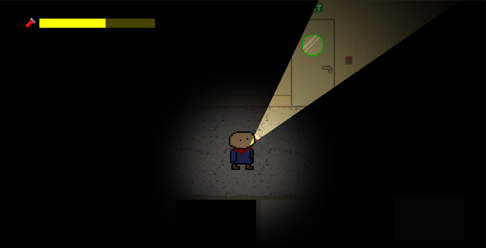
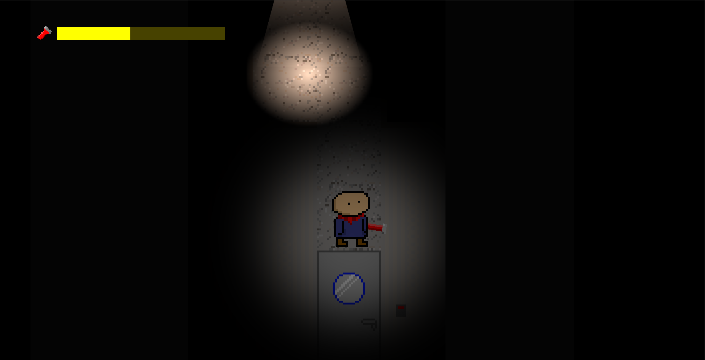
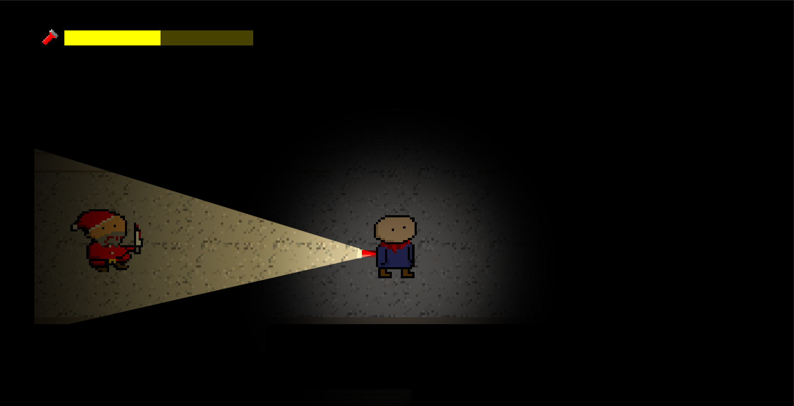

# Satan–Santa

Video game winner of the Epitech Marseille Game Jam on 23/12/2026.
Made in ~25 hours.
Headphones highly recommended for the best experience; sound design matters here.

## Overview

- Genre: Top‑down micro‑horror and exploration
- Engine: Godot 4.5
- Jam: Epitech Marseille Game Jam — 23/12/2026 — Winner
- Team: Niels, Léo, Max — Art support by Raphaelle

## Screenshots

## Controls

- Move: Arrow keys or WASD
- Interact: F
- Toggle flashlight/torch: Space

## Play It

Web (Browser):
Play on itch.io — [Satan-Santa](https://heisenburgr.itch.io/satan-santa)

### Running from Source (Godot)

1. Install Godot 4.5.
2. Clone this repo.
3. Open the project (project.godot) in Godot.
4. Press Run to start the game, or use Project → Export to create platform builds.

Notes:

- Web export is preconfigured (see export_presets.cfg). For desktop platforms, add the respective export presets in Godot 4.5 (macOS, Windows, Linux) and build.
- The project’s main scene is configured in the project settings; you can run directly after opening.

## Jam Context

Built for the Epitech Marseille Game Jam on 23/12/2026. The theme was "Christmas at Epitech".

## Credits

- Niels — GitHub: https://github.com/NielsOuvrard
- Léo — GitHub: https://github.com/Akeuuu
- Max — GitHub: https://github.com/Sookyuu
- Special thanks: Raphaelle — Artwork support
